<style>
section {
  font-family: 'Hiragino Sans W4';
  color: #444;
  font-size: 24px;
}
b, strong {
  font-family: 'Hiragino Sans W8';
}
ol {
  list-style-type: decimal;
}
h1, h2, h3, h4, h5, h6{
  font-family: 'Hiragino Sans W8';
  color: #2277cc;
}
pre, code {
  font-family: 'JetBrains Mono Slashed', 'Hiragino Sans W4';
  line-height: 1.3;
}
</style>

# デザインとプログラミング 2026<br>オリエンテーション

慶應義塾大学環境情報学部
田所 淳

---

## 講義の進めかた

- K-LMS (SFC SOL) はあまり活用しません
- その代わりに以下のページに講義資料を掲載していきます
- デザインとプログラミング2026 [https://yoppa.org/sfc-design26](https://yoppa.org/sfc-design26)

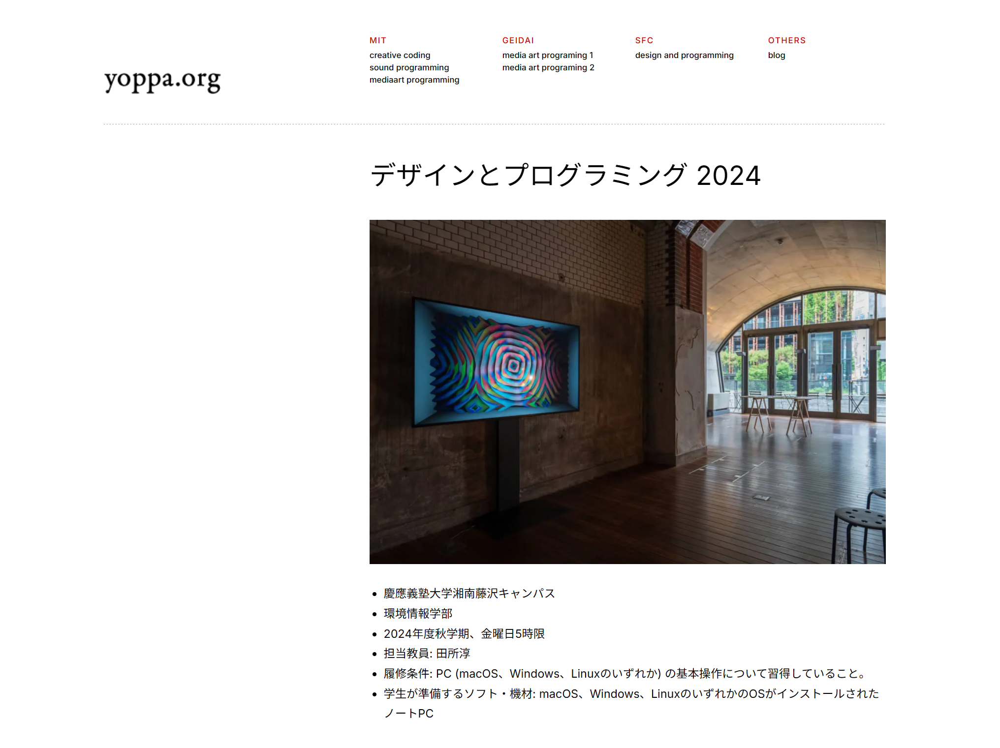

---

## 講義の進めかた

- 理想の講義構成 (今日は例外)
- 講義前半 :
  - 前回の提出課題の講評
  - 提出された課題をベースにしたコードの応用例など
  - 参考になる作品などの紹介
- 講義後半 :
  - 次回までの課題出題
  - 課題を作成するための教材の提示

---

# 生成AIについて

---

## 生成AIについて

- 生成AI (Generative AI)
  - 生成AI提供企業: Google ([Gemini](https://gemini.google.com/))、OpenAI ([ChatGPT](https://chatgpt.com/))、Anthropic ([Claude](https://claude.ai/))、Microsoft ([Copilot](https://copilot.microsoft.com/))、xAI ([Grok](https://grok.com/)) など
  - コード生成AI: [Gemini (Antigravity)](https://antigravity.google/)、[Codex](https://openai.com/codex/)、[Claude (Claude Code)](https://claude.com/product/claude-code)、[GitHub Copilot](https://github.com/features/copilot)、[Cursor](https://cursor.com/) など
  - 画像・動画生成AI: [Midjourney](https://www.midjourney.com/)、[Nano Banana](https://gemini.google/overview/image-generation/)、[Veo](https://deepmind.google/models/veo/)、[Adobe Firefly](https://firefly.adobe.com/) など
  - とてつもないスピードで進化中
  - 文章・画像・動画・音声、そしてプログラムまで生成可能
  - 質問に答えるだけでなく、自律的にコードを書いて実行・修正まで行う「AIエージェント」へ
  - この講義ではどう扱っていくか?

---

## 生成AIについて - 慶應義塾のガイドライン

- 参考: [慶應義塾における生成AIの利用ガイドライン](https://keio-univ.notion.site/ai-guideline)
- 基本姿勢は **「リスクを正しく理解しながら、生成AIを積極的に活用する」**
- この講義でもこの方針を支持: 禁止ではなく、どう活用するかを考えて行動していく

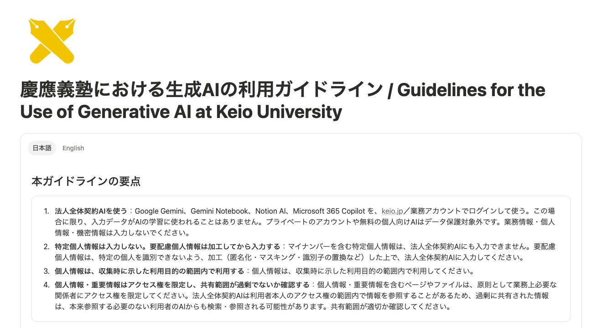

---

## 生成AIについて - 慶應義塾のガイドライン

- keio.jp アカウントでログインして使う「法人全体契約AI」を優先して使う
  - 入力したデータがAIの学習に使われない (データ保護あり)
- 学生が使える法人全体契約AI (2026年7月時点)
  - **Google Gemini / Gemini Notebook** (旧 NotebookLM) : 調査・要約・文章作成、手元の資料にもとづく質問応答
  - **Microsoft 365 Copilot Chat** : エンタープライズデータ保護 (EDP) を適用
- 個人のアカウントや無料のAIサービスはデータ保護の対象外
  - Google検索の「AIモード」や Google AI Studio も義塾のサービスの対象外

---

## 生成AIについて - 慶應義塾のガイドライン

- 授業・レポート・課題での利用は、シラバスや担当教員の方針に従う
- 個人情報・機密情報は、法人全体契約AI以外には入力しない
- 出力は必ずファクトチェックする (ハルシネーションに注意)
- AIの生成物が、既存の著作物や他人の肖像などの権利を侵害していないか確認する
- 読み込ませた文書やWebページに紛れ込んだ指示による誘導に注意する
- **最終的な判断と責任は、使う本人にある**

---

## 生成AIについて - 京都産業大学のガイドライン

- 参考: [京都産業大学 生成AI利用ガイドライン](https://www.kyoto-su.ac.jp/torikumi/ai-basic-stance/ai-guideline/) (2026年7月)
- 学生向けに「活用指針・遵守事項・リスク」を具体的な事例つきで解説
- 生成AIは使い方と心がけ次第で、学びの支援にも妨げにもなる


---

## 生成AIについて - 京都産業大学のガイドライン

- Ⅰ 学びのための活用指針
  - AIを思考の代替ではなく **支援ツール** として活用する
  - ファクトチェックを徹底する
  - アイデア出し、論点整理、プログラミングの補助など、学びの支援として活用する
- Ⅱ 学びの誠実性に関するルール
  - 【最優先】授業ごとの指示・条件を守る
  - AI生成物の無断提出 (丸写し / コピペ) の禁止
  - 課題丸投げ (思考過程丸投げ) の禁止
- Ⅲ 理解すべきリスク
  - バイアスを含んだ情報 / 情報漏洩と個人情報・機密情報 / 著作権侵害

---

## 生成AIについて - 京都産業大学のガイドライン

- 課題の丸投げは、長期的には考える力を低下させる **「認知的な借金」** になる
- 学びを損なう利用例
  - 課題を終わらせることだけを目的に、AIに短時間でやらせる
  - 提出物はよくできていても、質問されると自分の言葉で説明できない
  - 卒論のテーマや、自分が何に興味を持つべきかまでAIに決めてもらう
- 不正行為につながる利用例
  - AIが生成した文章をほとんど修正せずに提出する
  - AIが挙げた参考文献を、実在するか確認せずに記載する
  - 自分では説明できない内容を提出する

---

## 生成AIについて

- この講義では (他の講義についてはその指示に従う)
  - 生成AIは基本的に使用しても良い
  - ただ結果をそのままコピペするのではなく、より生産的な使用方法を考える
  - 生成された結果が誤りである可能性を常に考慮する
    - ソースにあたる (Web検索機能を使うと、多くの生成AIで出典が表示される)
    - 生成AIと検索を併用する
    - ...など
- いろいろ試行錯誤しながら一緒に考えていきましょう!

---

## 生成AIについて - Gemini 学割プラン

- 参考: [Google Gemini 学割プラン](https://gemini.google/jp/students/?hl=ja) : Google AI Plus が **1年間無料**
  - 18歳以上の大学生が対象、2026年12月31日までに登録
  - Geminiの利用上限が2倍、400GBのストレージ、学習ノートブック、Gemini Live など
  - 登録時に支払い方法の登録が必要 (解約しなければ無料期間後は毎月¥725)
- 注意: 個人のGoogleアカウントでの契約なので、keio.jp の Gemini (法人全体契約AI) とは別物
  - 慶應のガイドラインでは「個別契約AI」扱い → 個人情報・機密情報は入力しない

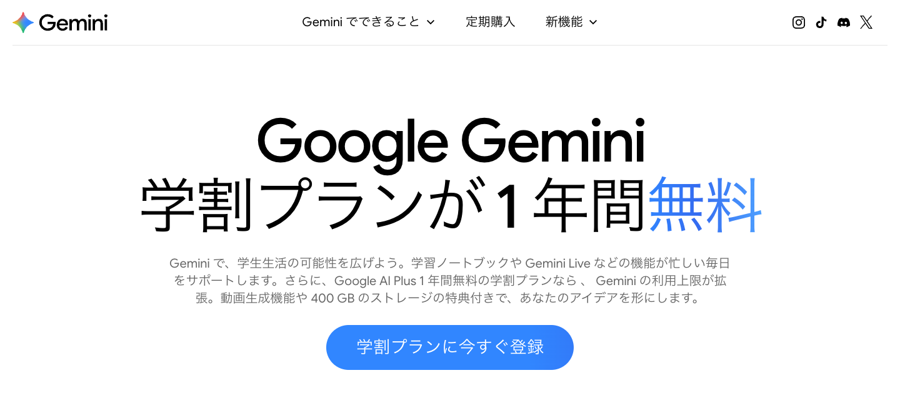

---

## 生成AIについて

- 参考: [Text-GPT-p5](https://text-gpt-p5.vercel.app/)
- この講義で使用する p5.js のコードをGPT-4o-miniを用いて対話的に生成!
- オープンソース!

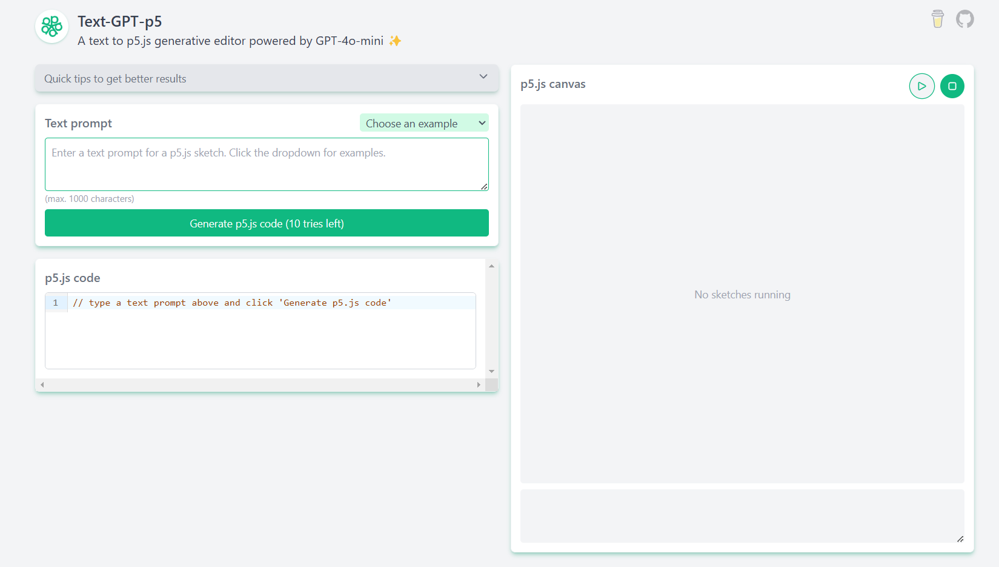

---

# 生成AIを使用したプログラミングのデモ

---

## 生成AIを使用したプログラミングのデモ

- p5.js (この講義で使用する環境) + GitHub Copilot (コード生成)
- 設定方法などはまた後日解説します!


---

# イントロダクション – ハイブリッドを目指そう!

---

## プログラマーの歴史 - ハッカーからハイブリッドへ

- History of the Future, Art & Technology from 1965 - Yesterday | Casey Reas | The Gray Area Festival
- [https://youtu.be/mHox98NFU3o](https://youtu.be/mHox98NFU3o)

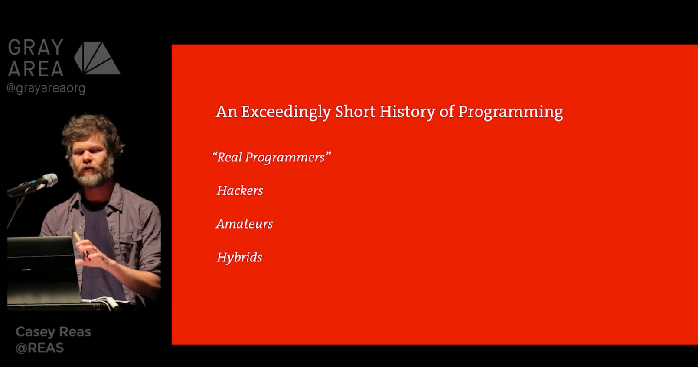

---

## プログラマーの歴史 - ハッカーからハイブリッドへ

- Casey Reasによる、プログラミングの超略史
- 4つの段階
  - リアル・プログラマー
  - ハッカー
  - アマチュア
  - ハイブリッド

---

# “Real Programmer”

---

## プログラマーの歴史 - リアル・プログラマー

- リアル・プログラマー : 「ガチの」プログラマー
- 1940’s 〜 50’s

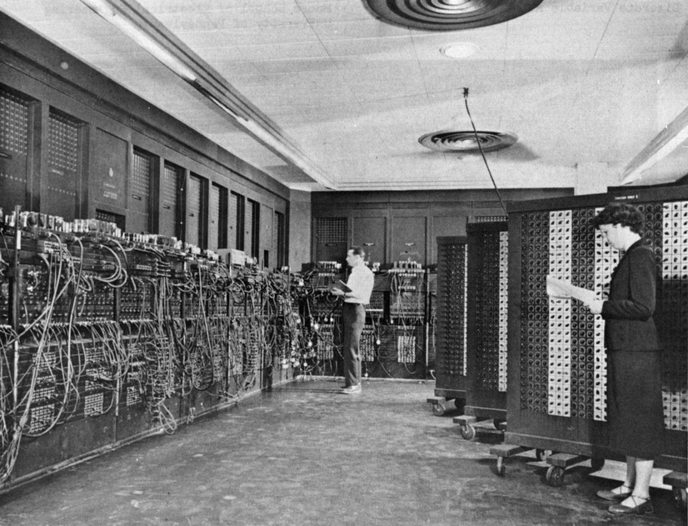

---

## プログラマーの歴史 - リアル・プログラマー

- コンピュータ黎明期のプログラマーは女性が多い

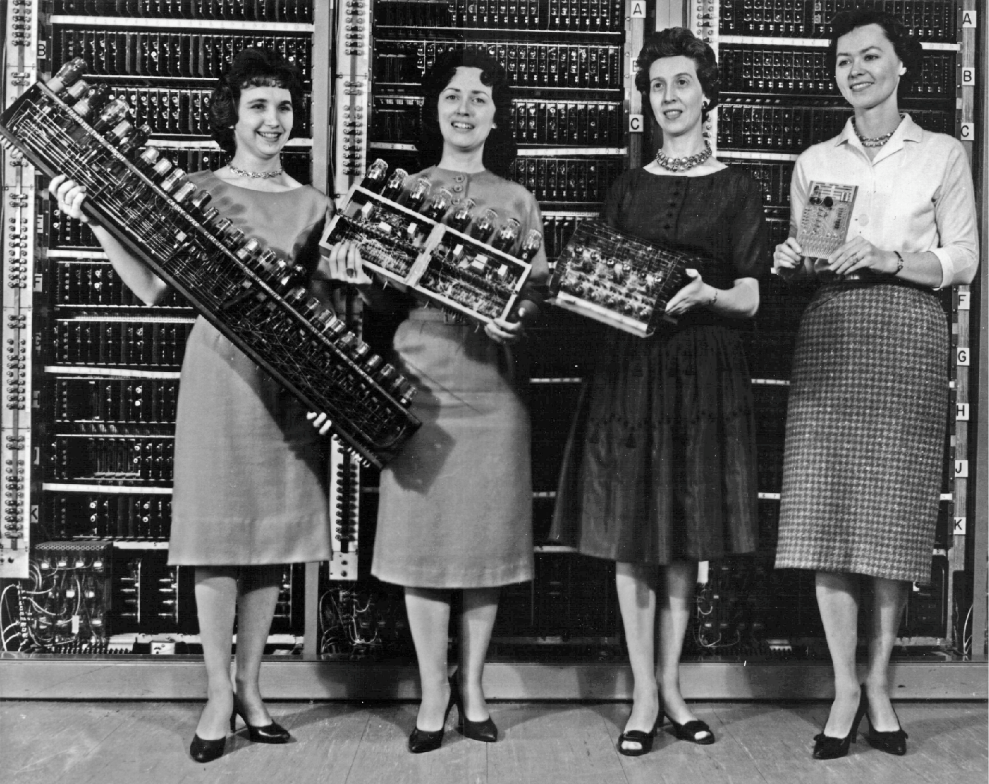 

---

## プログラマーの歴史 - リアル・プログラマー

- [ENIAC Programmers Project](http://eniacprogrammers.org/)

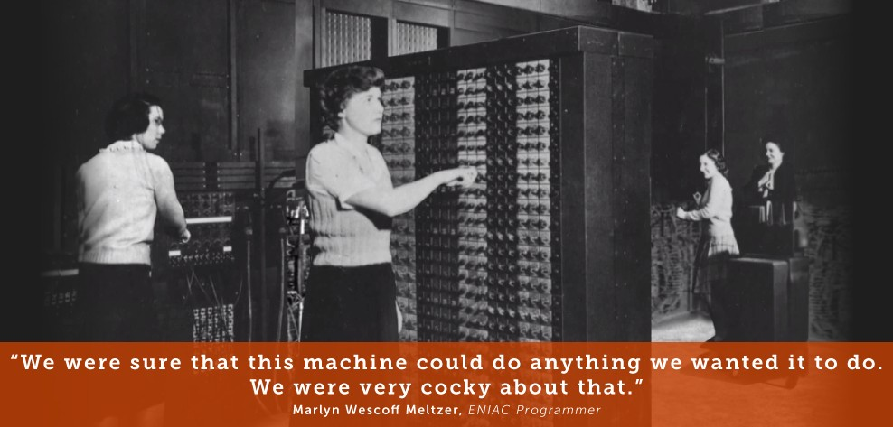

---

# Hackers

---

## プログラマーの歴史 - ハッカー

- ハッカーの時代 : 国家プロジェクトから大学・研究所へ
- 1960’s 〜 70’s

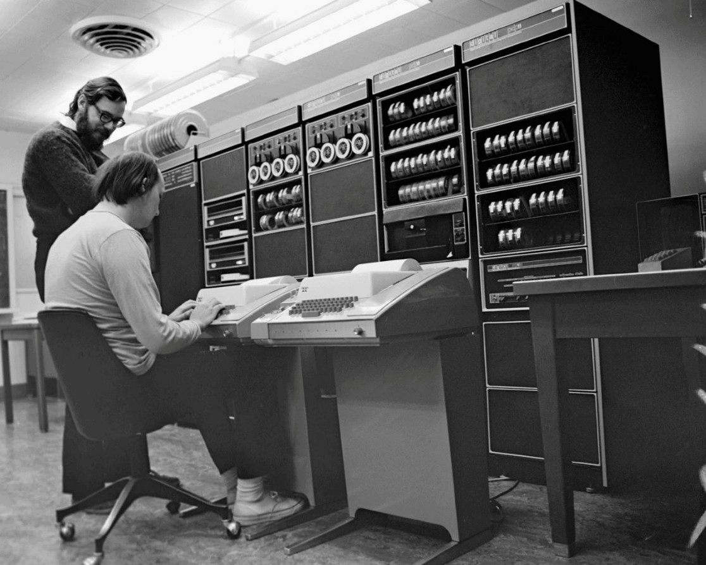 Ken Thompson and Dennis Ritchie at PDP-11

---

## プログラマーの歴史 - ハッカー

- ミニコン (ミニコンピュータ) の普及
- PDP-11

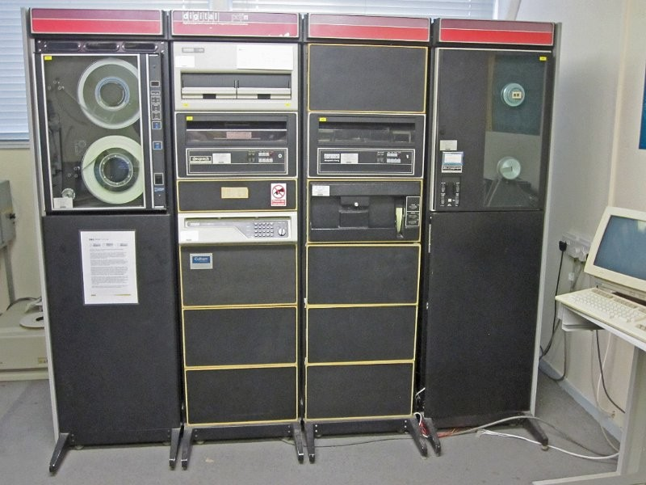

---

## プログラマーの歴史 - ハッカー

- ハッカーの時代 : コンピュータ・ゲームの誕生
- Spacewar! (MIT 1962) [https://youtu.be/Rmvb4Hktv7U](https://youtu.be/Rmvb4Hktv7U)

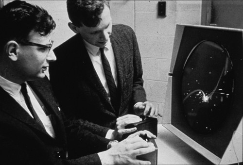

---

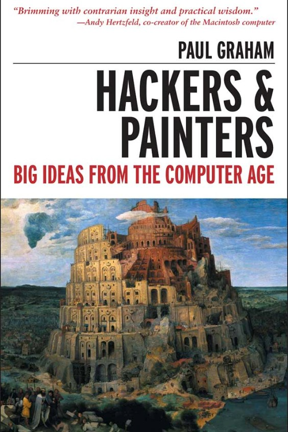

## プログラマーの歴史 - ハッカー

- [ハッカーと画家 - Hackers and Painters -](http://practical-scheme.net/trans/hp-j.html)
- Paul Graham, May 2003

> “ハッカーと画家に共通することは、どちらもものを創る人間だということだ。 作曲家や建築家や作家と同じように、ハッカーと画家がやろうとしているのは、 良いものを創るということだ。 良いものを創ろうとする過程で新しいテクニックを発見することがあり、 それはそれで良いことだが、いわゆる研究活動とはちょっと違う。”

---

# Amateurs

---

## プログラマーの歴史 - アマチュア

- アマチュア : ホビーとしてのパソコン
- 1980’s

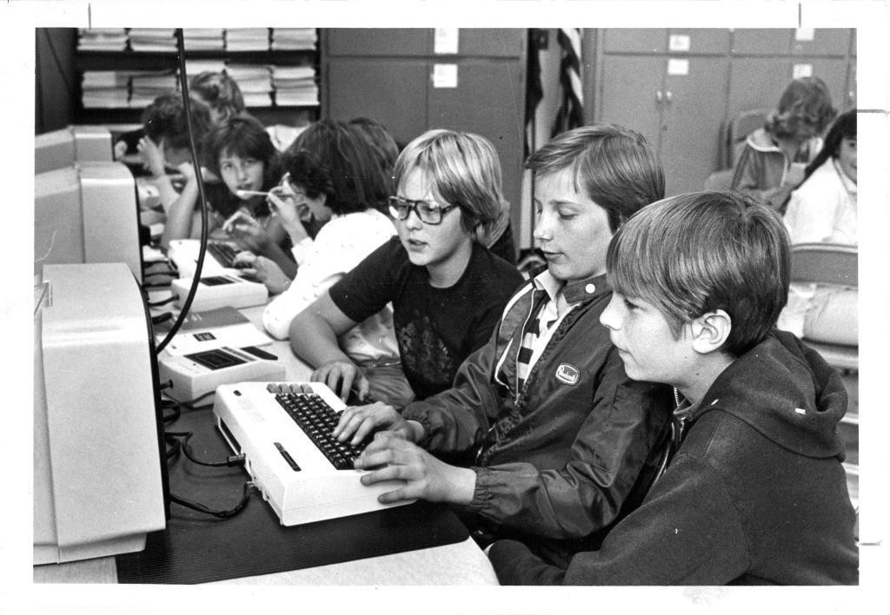

---

## プログラマーの歴史 - アマチュア

- 1980年代、日本でも「マイコンブーム」

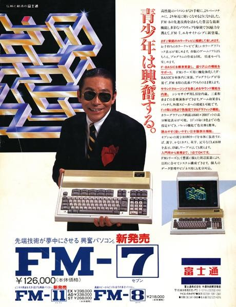 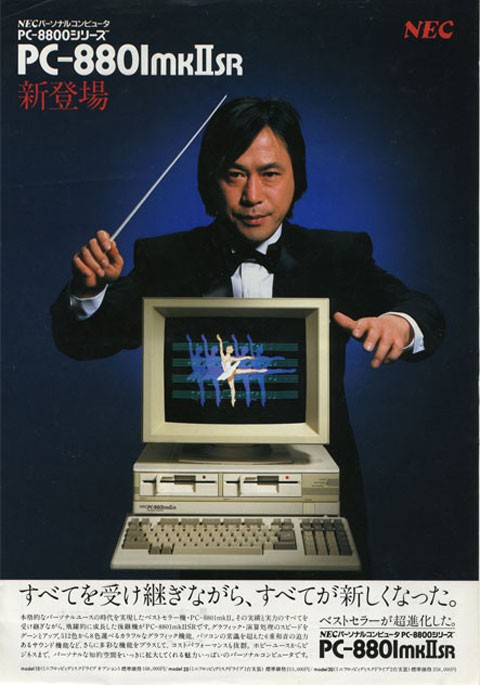

---

## プログラマーの歴史 - アマチュア

- Apple II (1977)
- Apple I の後継として、スティーブ・ウォズニアックが開発
- 世界初の個人向けに販売された、完成品マイクロコンピュータ

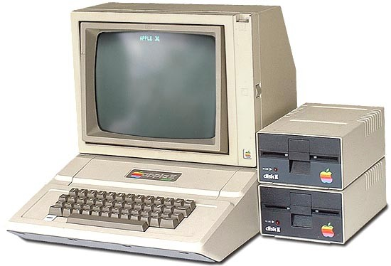

---

## プログラマーの歴史 - アマチュア

- Commodor 64 (1984)
- 単一機種としては最も販売台数の多いパーソナルコンピュータ
- 1250万から1700万台

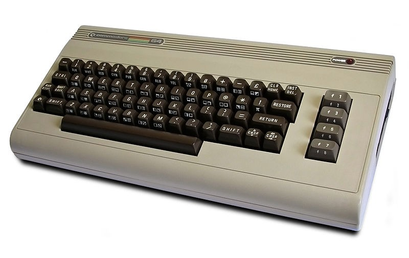

---

## プログラマーの歴史 - アマチュア

- HELLO WORLDをひたすらくりかえす

```basic
10 print "hello world!!"
20 goto 10
```

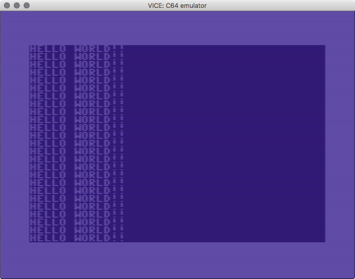

---

## プログラマーの歴史 - アマチュア

- ちょっと変更して改行を削除

```basic
10 print "hello world!!";
20 goto 10
```

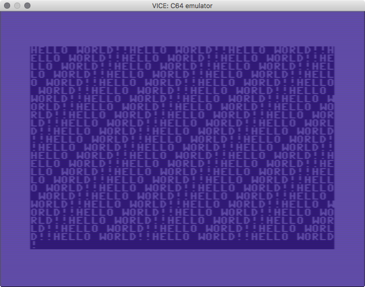

---

## プログラマーの歴史 - アマチュア

- ランダムに文字を出力

```basic
10 print chr$(32+96*rnd(1));
```

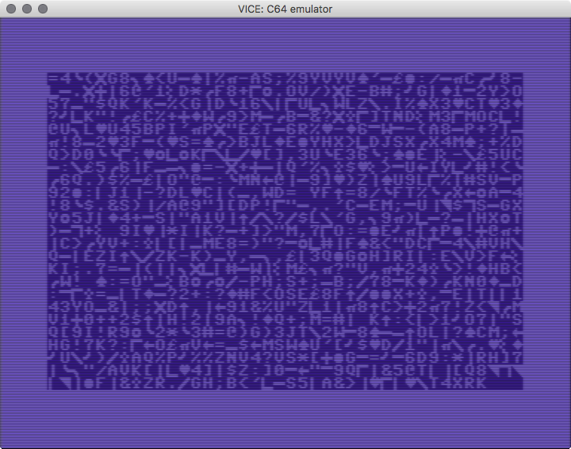

---

## プログラマーの歴史 - アマチュア

- 迷路のような模様が!!

```basic
10 print chr$(205.5+rnd(1));
```

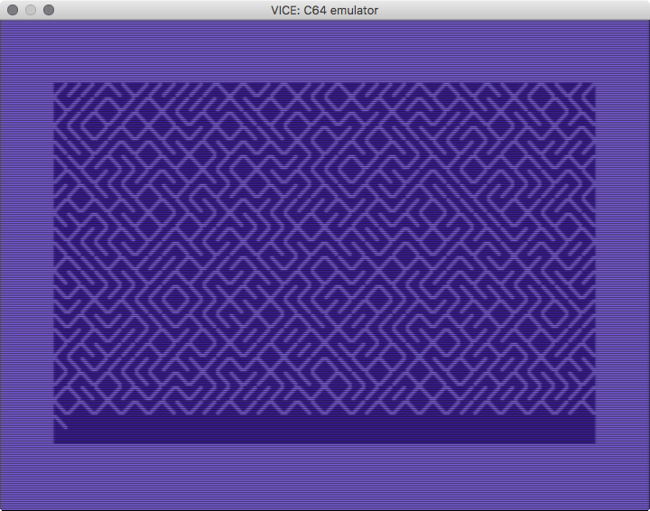

---

## プログラマーの歴史 - アマチュア

- いろいろなバリエーション

```basic
10 print chr$(205.1+rnd(1));
10 print chr$(205.9+rnd(1));
10 print chr$(198.5+rnd(1));
10 print chr$(204+(int(rnd(1)+.5)*3));
10 print chr$(204+(rnd(1)+.5)*3);
10 print chr$(181+(int(rnd(1)+.5)*3)+(ing(rnd(1)+.5)));
10 print chr$(181+(int(rnd(1)+.5)*3));
10 poke 1024+rnd(1)*1000,77.5+rnd(1)
```

---

## プログラマーの歴史 - アマチュア

- 参考: 10 PRINT [http://10print.org/](http://10print.org/)

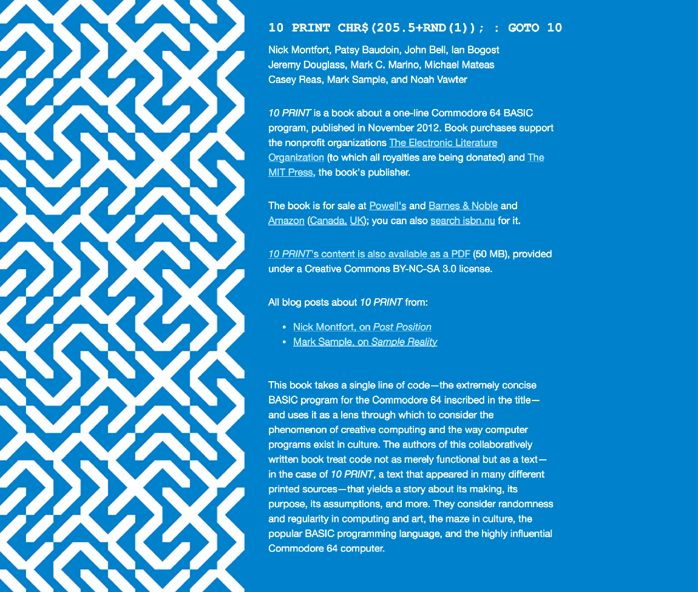

---

# Hybrids

---

## プログラマーの歴史 - ハイブリッド

- リアル・プログラマー → ハッカー → アマチュア
- 次に来るものは?
- ハイブリッドなプログラマー
- ハイブリッド (Hybrid) の意味するものとは?

 ‘the carrier’ by patricia piccinini, 2012

---

## プログラマーの歴史 - ハイブリッド

- これからは、専業プログラマーの時代ではない
- 他に専門をもったプログラマー
  - アート
  - デザイン
  - 建築
  - 広告
  - 統計
  - 政治
  - 経済
  - ...etc

---

## プログラマーの歴史 - ハイブリッド

- プログラマー以外の専門家もプログラミングをする時代
- 両方の知識と技術をハイブリッド

**ハイブリッドを目指しましょう!**

---

# 本日の課題

---

## 本日の課題

1. まずは、開発環境の準備
   - 最新の[Google Chrome](https://www.google.com/chrome/)をインストール
   - [Visual Studio Code](https://code.visualstudio.com/)をインストール (環境設定は次回やります)
2. 作品を共有するためのプラットフォーム
   - [OpenProcessing](https://openprocessing.org/)にユーザー登録

---

## 本日の課題

3. 以下のオンラインフォームに回答
   - [https://forms.gle/ZR2sY8EdMEg7swFL6](https://forms.gle/ZR2sY8EdMEg7swFL6)


