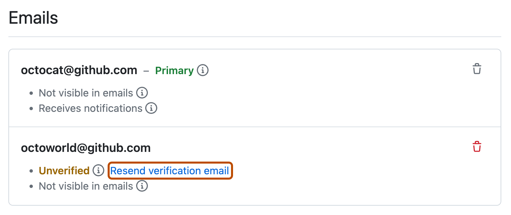
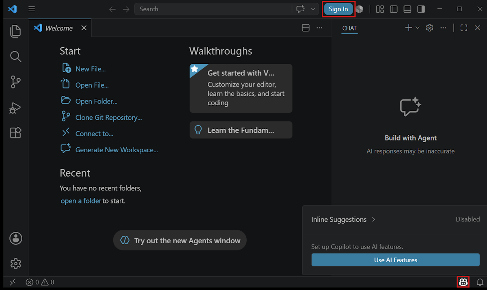
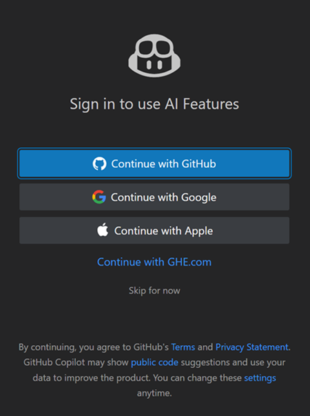
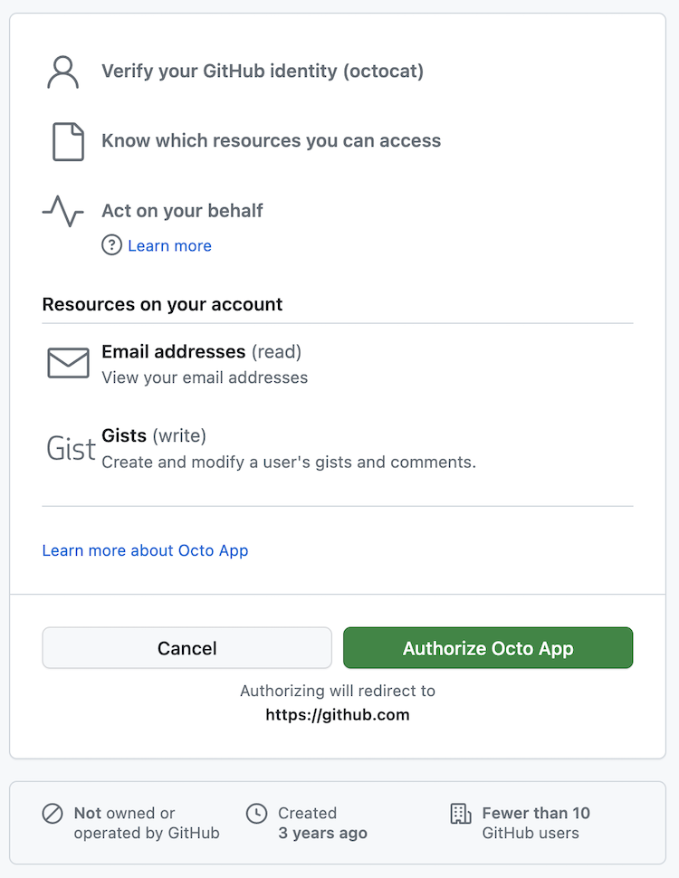
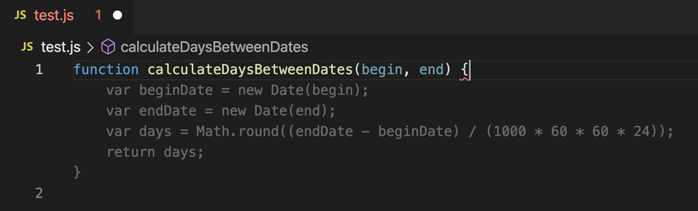
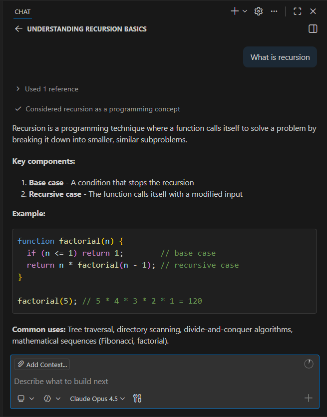
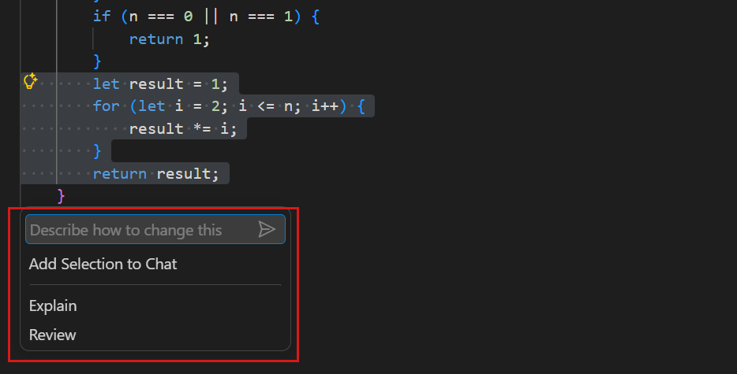
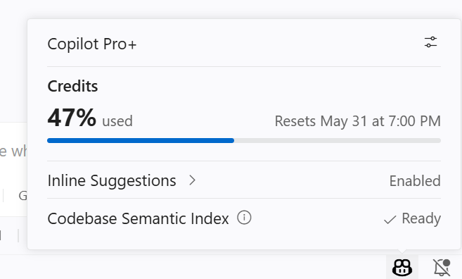
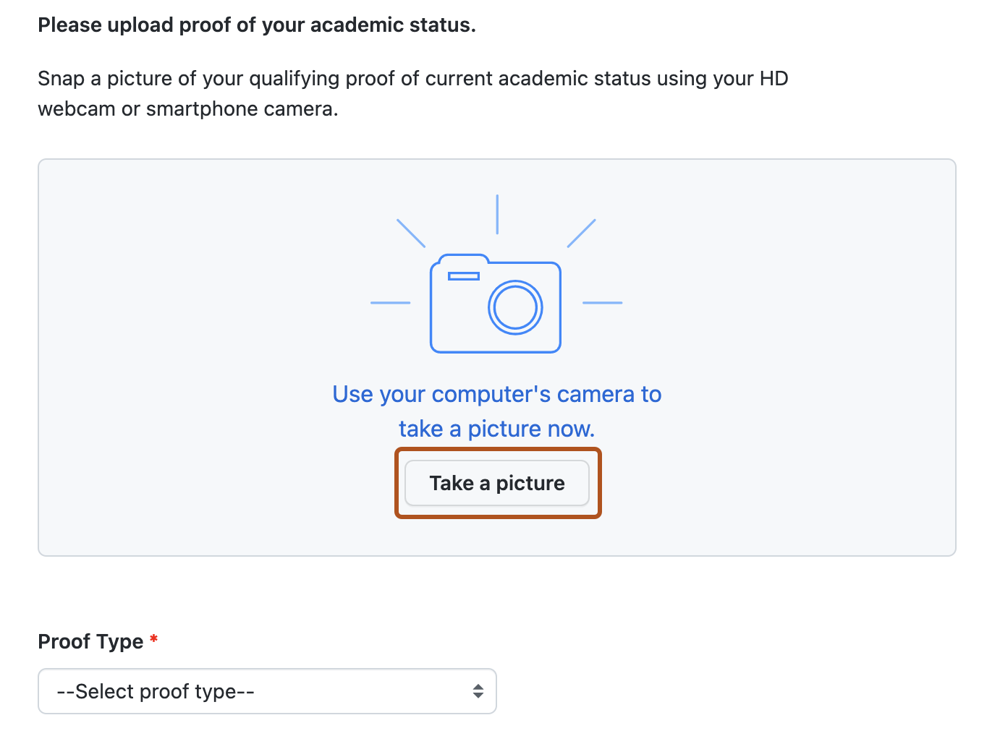
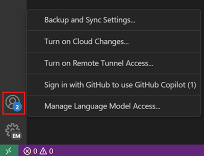

# デザインとプログラミング 2026 VS Code と GitHub Copilot のセットアップ

---

## このスライド資料で行うこと

- VS Code と GitHub Copilot のセットアップ手順の説明
  - VS Code には AI 機能(GitHub Copilot)が最初から入っている
    - 拡張機能のインストールは不要(VS Code 1.116 以降)
  - GitHub アカウントでサインインすれば使える
    - **コード補完**:書きかけのコードの続きを提案してくれる
    - **チャット**:コードについて日本語で質問できる

---

## 全体の流れ

1. VS Code をインストール
2. GitHub アカウントを作成
3. VS Code で AI 機能を有効にする
4. GitHub でサインインして認可
5. コード補完を試す
6. チャットを試す
7. 使用量を確認

---

## 1. VS Code をインストール

- https://code.visualstudio.com/ からダウンロード
- **Windows**:インストーラを実行(設定はデフォルトのままでOK)
- **macOS**:zip を展開し、Visual Studio Code.app を「アプリケーション」フォルダへ移動
- 最初はメニューが英語で表示される
  - このスライドでも英語の表示名で説明します

---

<!-- _footer: 画像出典:GitHub Docs(CC BY 4.0) -->

## 2. GitHub アカウントを作成

- https://github.com/ を開いて **Sign up**(Google アカウントでも登録できる)
- メールアドレス・パスワード・ユーザー名・国/地域を入力し、人間確認のパズルを解く
- メールに届く確認コードを入力して **メール認証を完了**
  - 認証状態は Settings > Emails で確認できる(Unverified なら再送できる)

---

<!-- _footer: 画像出典:Visual Studio Code Docs(CC BY 3.0 US) -->

## 3. VS Code で AI 機能を有効にする

- 次のどちらかをクリック(図の赤枠)
  - タイトルバー右上の **Sign In**
  - 右下ステータスバーの Copilot アイコン → **Use AI Features**

---

<!-- _footer: 画像出典:Visual Studio Code Docs(CC BY 3.0 US) -->

## 4-1. サインイン方法を選ぶ

- **Continue with GitHub** を選ぶ
- ブラウザが開くので、手順2で作ったアカウントでログイン
- Copilot の契約がないアカウントは、自動的に **Copilot Free** に登録される

---

<!-- _footer: 画像出典:GitHub Docs(CC BY 4.0) -->

## 4-2. ブラウザで認可する

- VS Code からのアクセスを許可する画面が出たら、緑の **Authorize** ボタンを押す
  - 右は画面の例。実際はアプリ名が Visual Studio Code と表示される
- 「Visual Studio Code を開きますか?」と聞かれたら許可して VS Code に戻る
- 右下の Copilot アイコンを開き、プラン名(Copilot Free など)が出ていれば完了

---

<!-- _footer: 画像出典:Visual Studio Code Docs(CC BY 3.0 US) -->

## 5. コード補完を試す

- File > New Text File で新規ファイルを作り、`sketch.js` などの名前で保存
- 関数名やコメントを書くと、続きのコードが **薄いグレー** で提案される

- **Tab**:提案を確定 / **Esc**:提案を破棄
- 試してみよう:`// 1から10までの合計をコンソールに表示する` と書いて改行

---

<!-- _footer: 画像出典:Visual Studio Code Docs(CC BY 3.0 US) -->

## 6-1. チャットで質問する

- 開き方
  - **Ctrl+Alt+I**(macOS は **⌃⌘I**)
  - またはタイトルバーの **Chat** メニュー → **Open Chat**
- 画面の右側にチャット欄が開く
- 下の入力欄に日本語で質問できる
  - 例:「このコードを説明して」
  - 例:「エラーの原因を教えて」

---

<!-- _footer: 画像出典:Visual Studio Code Docs(CC BY 3.0 US) -->

## 6-2. インラインチャットでコードを直す

- エディタ上で **Ctrl+I**(macOS は **⌘I**)
- 入力欄に「こう変えて」と指示して Enter
  - 先にコードを選択しておくと、その部分だけが対象になる
- 提案された変更は **Keep**(採用)/ **Undo**(取り消し)で選ぶ

---

<!-- _footer: 画像出典:Visual Studio Code Docs(CC BY 3.0 US) -->

## 7. 使用量を確認

- 右下ステータスバーの Copilot アイコンをクリック
- その月の利用枠を何%使ったかが表示される
  - 右は有料プランの例。Free ではコード補完の使用量も表示される
- Copilot Free には月ごとの上限がある
  - コード補完:2,000回まで
  - チャット:AIクレジットの範囲内
- 課題で使う前に残りを確認しておこう

---

<!-- _footer: 画像出典:GitHub Docs(CC BY 4.0) -->

## 学生は Copilot Student が使える

- GitHub Education で学生認証をすると、無料の **Copilot Student** を利用できる
- 申請・有効化のページ
  - https://github.com/settings/education/benefits
  - 大学のメールアドレスを登録し、学生証などの写真を提出して申請
- 認証後、同じページで Copilot Student を有効化
  - 反映まで数日かかることがある
- 詳しい手順:[GitHub Docs「Copilot Student の設定」](https://docs.github.com/en/copilot/how-tos/copilot-on-github/set-up-copilot/enable-copilot/set-up-for-students)

---

## データの扱いについて

- Copilot Free は初期設定で次のようになっている
  - テレメトリ(利用データの送信)が有効
  - 公開コードと一致する提案も許可
- 変更したい場合
  - VS Code の設定で `telemetry.telemetryLevel` を `off` にする
  - https://github.com/settings/copilot で Copilot の設定を見直す

---

<!-- _footer: 画像出典:Visual Studio Code Docs(CC BY 3.0 US) -->

## うまくいかないとき

- **Sign In ボタンも Copilot アイコンも見当たらない**
  - 左下の人型アイコン(Accounts)→ **Sign in with GitHub to use GitHub Copilot**
  - VS Code を最新版に更新(1.116 以降が必要)
- **別の GitHub アカウントでサインインしてしまった**
  - Accounts メニューから Sign out して、正しいアカウントで入り直す
- **補完が出ない**
  - ファイルを拡張子付き(`.js` など)で保存しているか確認

---

## まとめ

- VS Code だけで AI のコード補完とチャットが使える
- 必要なのは GitHub アカウントとサインインだけ
- 無料枠には月ごとの上限がある → 使用量をときどき確認しよう

---

## 画像出典

- Visual Studio Code Docs(© Microsoft, CC BY 3.0 US)
  - https://code.visualstudio.com/docs
  - 画像ファイルは https://github.com/microsoft/vscode-docs から取得
  - チャットとインラインチャットの画像は一部を切り抜いて使用
- GitHub Docs(© GitHub, CC BY 4.0)
  - https://docs.github.com/
  - 画像ファイルは https://github.com/github/docs から取得
  - OAuth アプリの認可、メール認証、GitHub Education の画面
